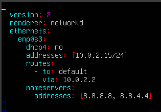
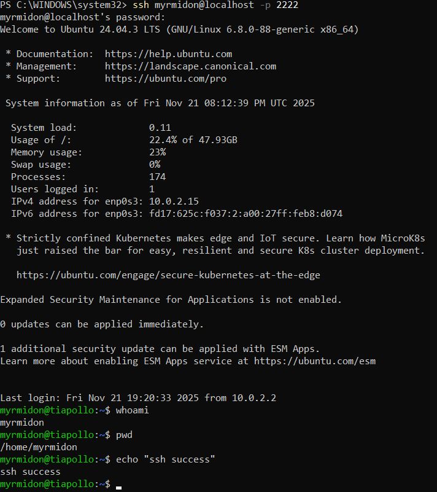
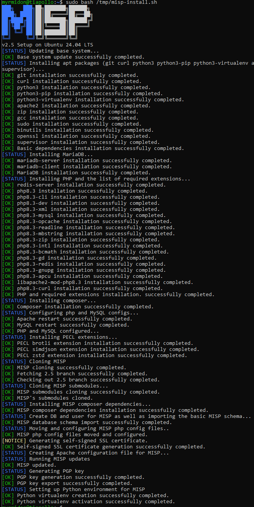
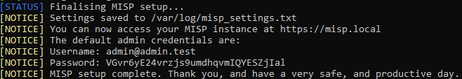
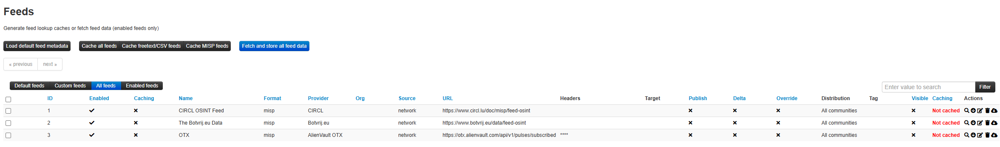
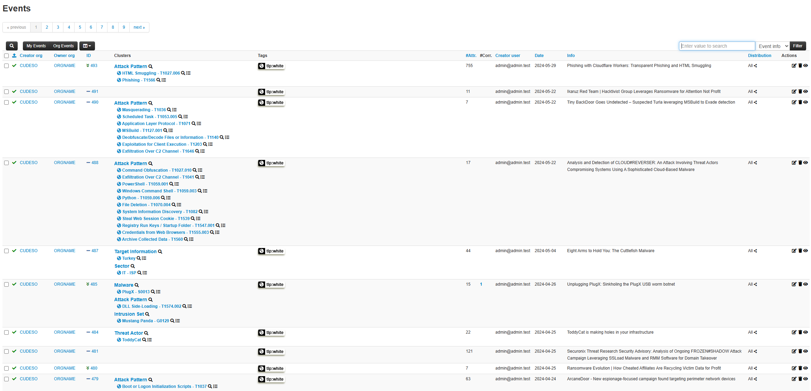
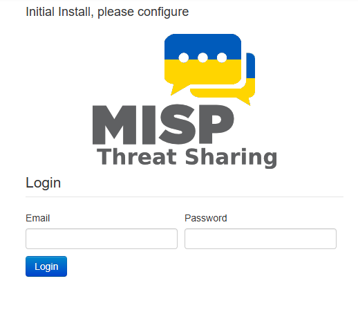
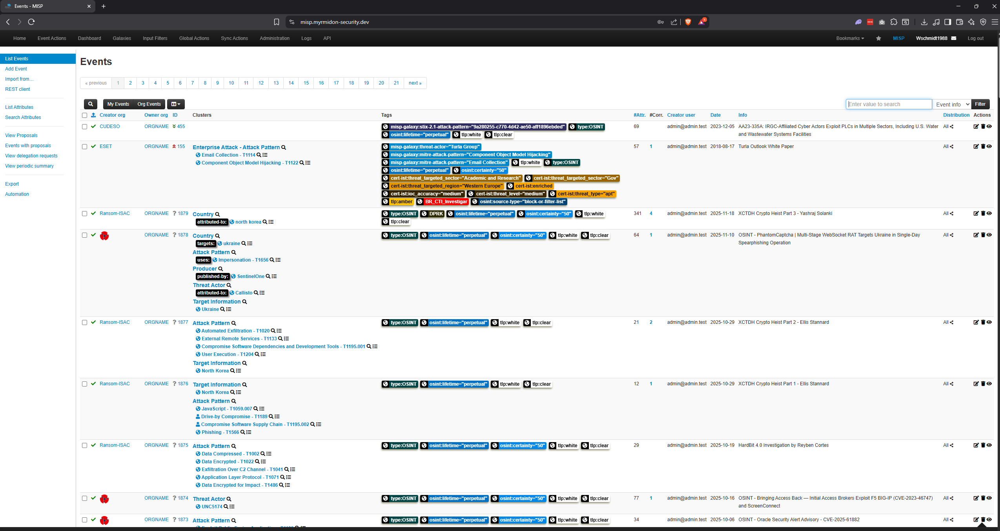

# MISP Threat Intel Platform – Remote Access Setup (2025)

A fully functional MISP 2.5.26 instance running in a VirtualBox Ubuntu 24.04 VM on a Windows 11 host (aka my old Asus laptop), globally accessible via Cloudflare Tunnel.

For a live demo, DM me on LinkedIn and we'll get you set up with credentials to access and read TI feeds.

**Live URL**: https://misp.myrmidon-security.dev  
**Local URL**: http://127.0.0.1:8080 (on the host laptop only)

## Current Working Configuration

### VirtualBox VM
- Ubuntu Server 24.04.3 LTS
- NAT networking with port forwarding:
  - Host 2222 → Guest 22 (SSH)
  - Host 8080 → Guest 80 (MISP web)
- Static NAT IP: 10.0.2.15/24

### MISP
- Version: 2.5.26
- Apache listening on 0.0.0.0:80 (IPv4 only)
- Critical settings (set via MISP CLI)

### Screenshots

